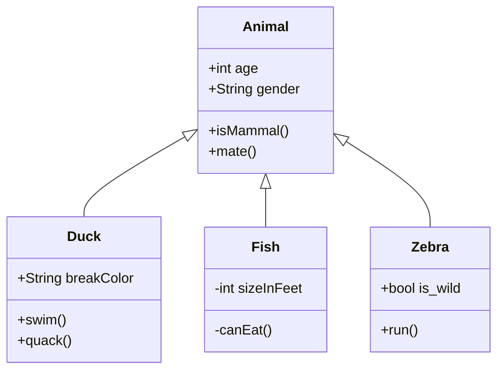
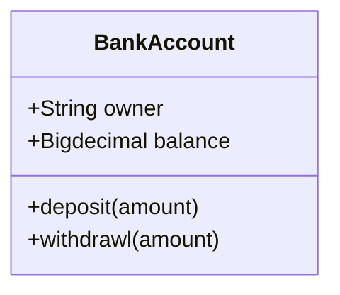
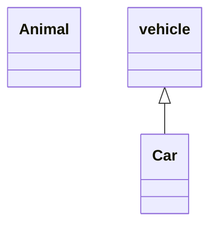
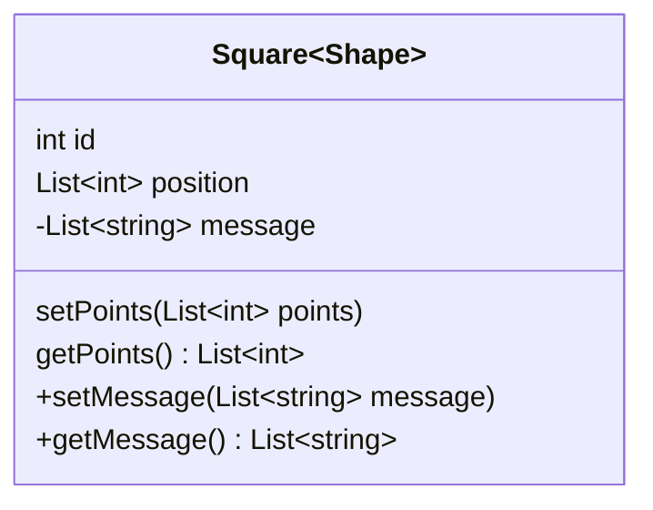
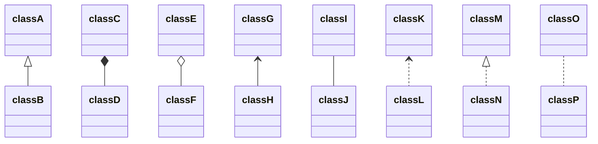
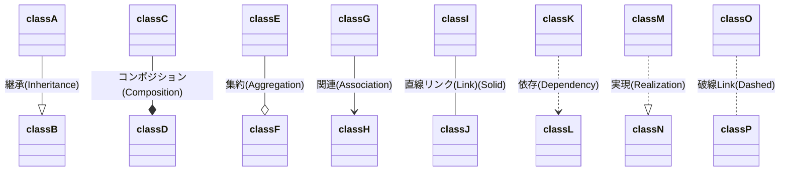
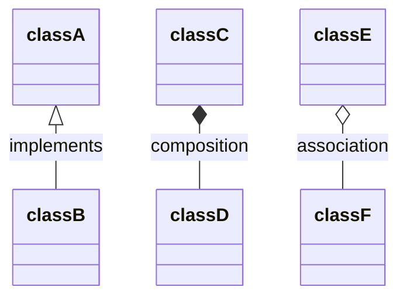
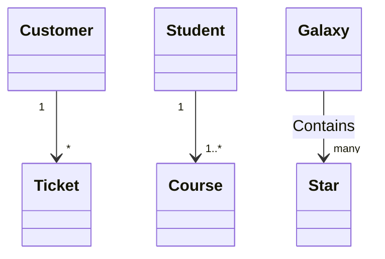
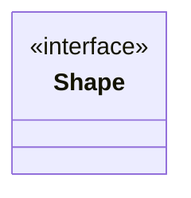
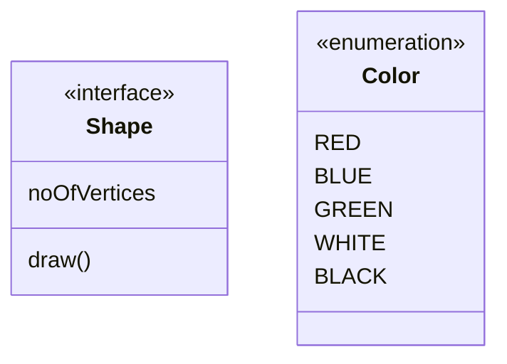

# Class diagrams




---


# Syntax

- 上部のコンパートメント
  - クラスの名前が含まれている
  - 太字で中央に表示され、最初の文字は大文字になる
  - また、クラスの性質を説明するオプションの注釈テキストが含まれる場合もある
- 中央のコンパートメント
  - クラスの属性が含まれている
  - 左揃えで、最初の文字は小文字
- 下部のコンパートメント
  - クラスが実行できる操作が含まれる
  - 左揃えで、最初の文字は小文字




---


# Define a class


## 2種類のクラス定義方法

- `class Animal` のようなキーワードクラスを使用してクラスを明示的に定義
- `Vehicle<| -Car` のように、2つのクラスの関係とともに定義



## 命名規則

- クラス名は、英数字とアンダースコア文字で構成する必要あり


---


# Defining Members of a class


- Mermaidは、括弧 `()` が存在するかどうかに基づいて、属性と関数/メソッドを区別している
  - `()` が付いているものは関数/メソッドとして扱われ、その他は属性として扱われる
- クラスのメンバーを定義する方法は2つ

## コロンの後にメンバー名を使用してクラスのメンバーを関連付け

```
class BankAccount
BankAccount : +String owner
BankAccount : +BigDecimal balance
BankAccount : +deposit(amount)
BankAccount : +withdrawal(amount)
```

## 波括弧を使用してクラスのメンバーを関連付け

```
class BankAccount{
    +String owner
    +BigDecimal balance
    +deposit(amount)
    +withdrawl(amount)
}
```

## Return Type

- メソッドの返り値は、末尾に半角スペース区切りで記述
```
class BankAccount{
    +String owner
    +BigDecimal balance
    +deposit(amount) bool
    +withdrawl(amount) int
}
```

## Generic Types

- `List <int>` などのジェネリック型を使用して、型を `~` (チルダ) で囲むことによって定義できる


## Visibility

### アクセス修飾子を表す記号

- `+` Public
- `-` Private
- `#` Protected
- `~` Package/Internal
- `*` Abstract
- `$` Static


---


# Defining Relationship

- `relationship` は、クラス図とオブジェクト図に見られる特定のタイプの論理接続をカバーする一般的な用語

```
[classA][Arrow][ClassB]:LabelText
```

Type   | Description
-------| ------------
`<|--` | 継承 (Inheritance)
`o--`  | 集約 (Aggregation) (クラス間の関連で全体と一部という関係性を表現)
`*--`  | コンポジション (Composition) (集約よりも強い集約)
`-->`  | 関連 (Association) (クラス間の関連を表現)
`..>`  | 依存 (Dependency)
`..|>` | 実現 (Realization) (クラス間のインターフェースを表現)
`--`   | 直線リンク (Link) (Solid)
`..`   | 破線Link (Dashed)



- ラベルを使用して、2つのクラス間の関係の性質を説明することも可能
- 矢印は反対方向にも使用できる



---


# Labels on Relations

- リレーションにラベルテキストを追加することが可能
```
[classA][Arrow][ClassB]:LabelText
```



---


# Cardinality / Multiplicity on relations

- 多重度表記は、関連付けの終わり近くに配置

## カーディナリティのオプション

- `1` Only 1
- `0..1` Zero or One
- `1..*` One or more
- `*` Many
- `n` n {where n>1}
- `0..n` zero to n {where n>1}
- `1..n` one to n {where n>1}

## カーディナリティの定義

- カーディナリティは、指定された矢印の前(オプション)と後(オプション)の引用符でカーディナリティテキストを配置することで簡単に定義できる
```
[classA] "cardinality1" [Arrow] "cardinality2" [ClassB]:LabelText
```



---


# Annotations on classes

- クラスのメタデータのような特定のマーカーテキストでクラスに注釈を付けて、その性質を明確に示すことができる
- 注釈は、 `<<` と `>>` で定義
- クラスに注釈を追加する方法は2つ

## 一般的な注釈の例

- `<<Interface>>` To represent an Interface class
- `<<abstract>>` To represent an abstract class
- `<<Service>>` To represent a service class
- `<<enumeration>>` To represent an enum

## クラスが定義された後の別の行に定義する例



## クラス定義とともにネストされた内側に定義する例

