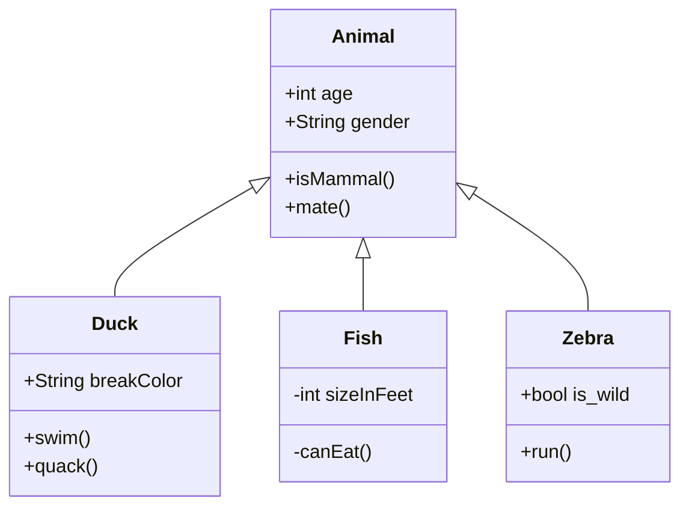
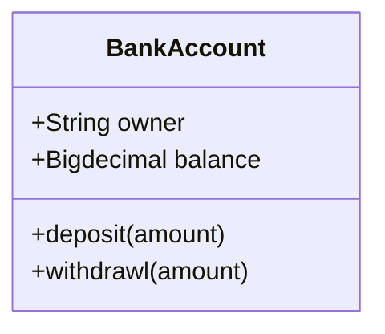

# Class diagrams

---

# Syntax

- 上部のコンパートメント
  - クラスの名前が含まれている
  - 太字で中央に表示され、最初の文字は大文字になる
  - また、クラスの性質を説明するオプションの注釈テキストが含まれる場合もある
- 中央のコンパートメント
  - クラスの属性が含まれている
  - 左揃えで、最初の文字は小文字
- 下部のコンパートメント
  - クラスが実行できる操作が含まれる
  - 左揃えで、最初の文字は小文字

