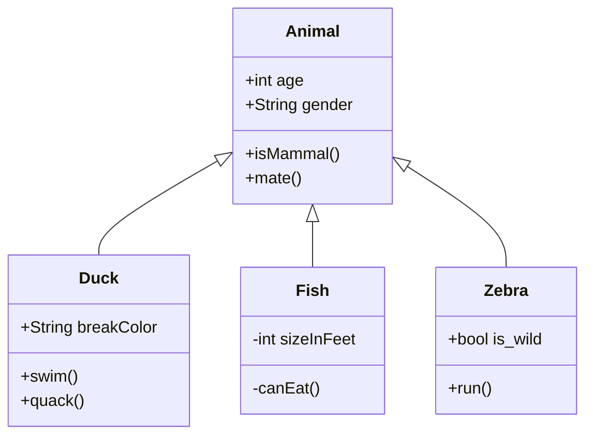
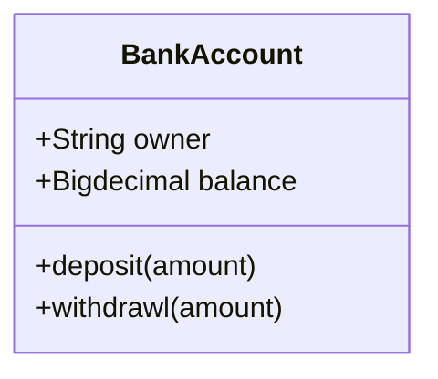
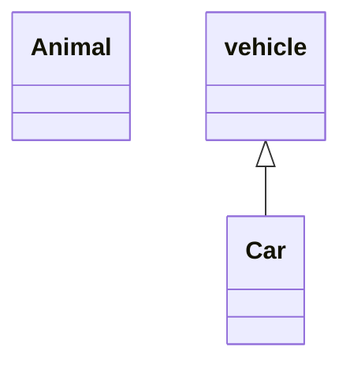
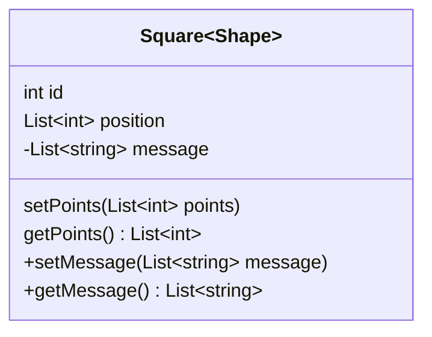

# Class diagrams




---


# Syntax

- 上部のコンパートメント
  - クラスの名前が含まれている
  - 太字で中央に表示され、最初の文字は大文字になる
  - また、クラスの性質を説明するオプションの注釈テキストが含まれる場合もある
- 中央のコンパートメント
  - クラスの属性が含まれている
  - 左揃えで、最初の文字は小文字
- 下部のコンパートメント
  - クラスが実行できる操作が含まれる
  - 左揃えで、最初の文字は小文字




---


# Define a class


## 2種類のクラス定義方法

- `class Animal` のようなキーワードクラスを使用してクラスを明示的に定義
- `Vehicle<| -Car` のように、2つのクラスの関係とともに定義



## 命名規則

- クラス名は、英数字とアンダースコア文字で構成する必要あり


---


# Defining Members of a class


- Mermaidは、括弧 `()` が存在するかどうかに基づいて、属性と関数/メソッドを区別している
  - `()` が付いているものは関数/メソッドとして扱われ、その他は属性として扱われる
- クラスのメンバーを定義する方法は2つ

## コロンの後にメンバー名を使用してクラスのメンバーを関連付け

```
class BankAccount
BankAccount : +String owner
BankAccount : +BigDecimal balance
BankAccount : +deposit(amount)
BankAccount : +withdrawal(amount)
```

## 波括弧を使用してクラスのメンバーを関連付け

```
class BankAccount{
    +String owner
    +BigDecimal balance
    +deposit(amount)
    +withdrawl(amount)
}
```

## Return Type

- メソッドの返り値は、末尾に半角スペース区切りで記述
```
class BankAccount{
    +String owner
    +BigDecimal balance
    +deposit(amount) bool
    +withdrawl(amount) int
}
```

## Generic Types

- `List <int>` などのジェネリック型を使用して、型を `~` (チルダ) で囲むことによって定義できる


## Visibility

### アクセス修飾子を表す記号

- `+` Public
- `-` Private
- `#` Protected
- `~` Package/Internal
- `*` Abstract
- `$` Static
