# Flowcharts - Basic Syntax


## A node (default)

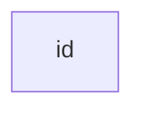

## A node with text


---


# Graph

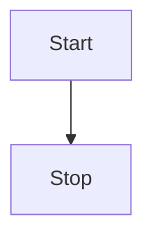


---


# Flowchart Orientation

Possible FlowChart orientations are:

- `TB` - top to bottom
- `TD` - top-down/ same as top to bottom
- `BT` - bottom to top
- `RL` - right to left
- `LR` - left to right


---


# Node shapes


## A stadium-shaped node


## A node in a subroutine shape


## A node in a cylindrical shape

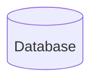

## A node in the form of a circle

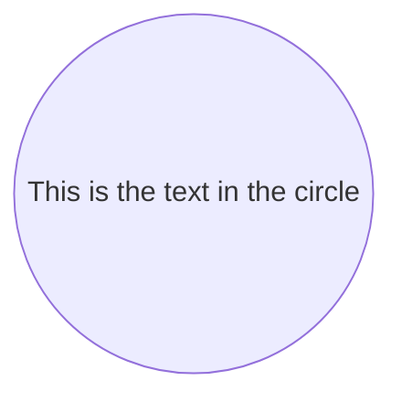

## A node in an asymmetric shape


## A node (rhombus)

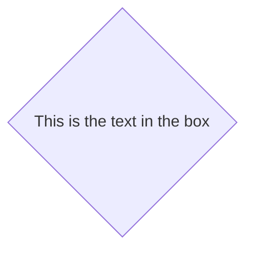

## A hexagon node


## Parallelogram

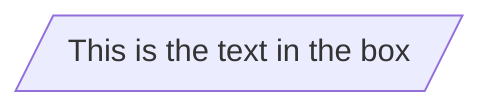

## Parallelogram alt

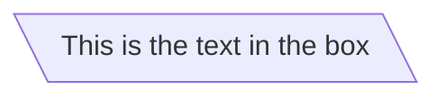

## Trapezoid

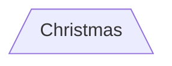

## Trapezoid alt

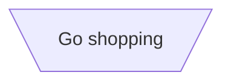

---


# Links between nodes

## A link with arrow head

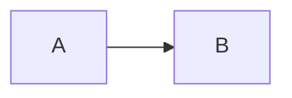

## An open link

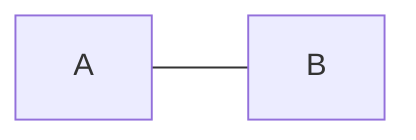

## Text on links

- 先頭が `-` 2つで、末尾が `-` ３つ
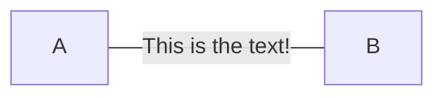

## A link with arrow head and text

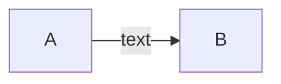
or
```mermaid
graph LR
  A-- text -->B
```

## Dotted link

```mermaid
graph LR;
  A-.->B
```

## Dotted link with text

```mermaid
graph LR
  A-. text .->B
```

## Thick link

```mermaid
graph LR
  A ==> B
```

## Thick link with text

```mermaid
graph LR
  A == text ===> B
```

## Chaining of links

```mermaid
graph LR
  A -- text --> B -- text2 --> C
```

```mermaid
graph LR
  a --> b & c --> d
```

```mermaid
graph TB
  A & B --> C & D
```
or
```mermaid
graph TB
  A --> C
  A --> D
  B --> C
  B --> D
```

## Beta: New arrow types

```mermaid
flowchart LR
  A --o B
  B --x C
```

## Beta: Multi directional arrows

```mermaid
flowchart LR
  A o--o B
  B <--> C
  C x--x D
```

## Minimum length of a link

- リンクに使う `-` の数を増やすと、通常のリンクよりも増やした分だけ多くのランクにまたがる表示になる
```mermaid
graph TD
  A[Start] --> B{Is it?};
  B -->|Yes| C[OK];
  C --> D[Rethink];
  D --> B;
  B ---->|No| E[End];
```
- リンクの中央にリンクラベルが書かれている場合は、リンクの右側にダッシュを追加する必要あり
```mermaid
graph TD
  A[Start] --> B{Is it?};
  B -- Yes --> C[OK];
  C --> D[Rethink];
  D --> B;
  B -- No ----> E[End];
```

## 点線または太いリンクの場合、追加する文字の要約

Length            | 1    | 2     | 3
------------------|------|-------|--------
Normal            | ---  | ----  | -----
Normal with arrow | -->  | --->  | ---->
Thick             | ===  | ====  | =====
Thick with arrow  | ==>  | ===>  | ====>
Dotted            | -.-  | -..-  | -...-
Dotted with arrow | -.-> | -..-> | -...->


---


# Special characters that break syntax


```mermaid
graph LR
  id1["This is the (text) in the box"]
```

## Entity codes to escape characters

```mermaid
graph LR
  A["A double quote:#quot;"] -->B["A dec char:#9829;"]
```


--


# Subgraphs

```
subgraph title
  graph definition
end
```

```mermaid
graph TB
  c1-->a2
  subgraph one
  a1-->a2
  end
  subgraph two
  b1-->b2
  end
  subgraph three
  c1-->c2
  end
```

- サブグラフに明示的なIDを設定することも可能
```mermaid
graph TB
  c1-->a2
  subgraph ide1 [one]
  a1-->a2
  end
```


---


# Beta: flowcharts

- グラフタイプのフローチャートを使用すると、以下のグラフのように、サブグラフとの間でエッジを設定することも可能

```mermaid
flowchart TB
  c1-->a2
  subgraph one
  a1-->a2
  end
  subgraph two
  b1-->b2
  end
  subgraph three
  c1-->c2
  end
  one --> two
  three --> two
  two --> c2
```
