# Flowcharts - Basic Syntax


## A node (default)

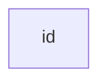

## A node with text


---


# Graph

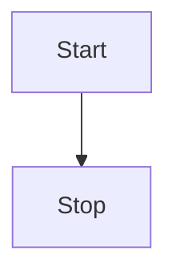

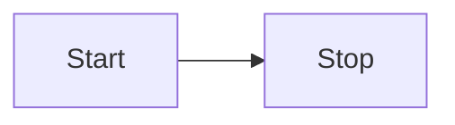


---


# Flowchart Orientation

Possible FlowChart orientations are:

- `TB` - top to bottom
- `TD` - top-down/ same as top to bottom
- `BT` - bottom to top
- `RL` - right to left
- `LR` - left to right


---


# Node shapes

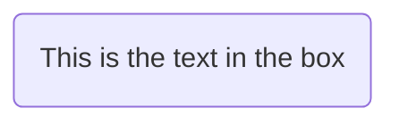

## A stadium-shaped node


## A node in a subroutine shape


## A node in a cylindrical shape

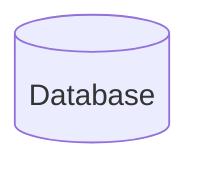

## A node in the form of a circle

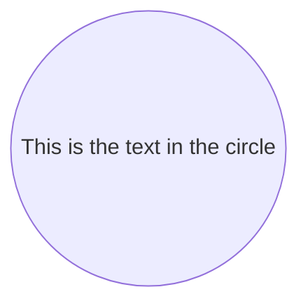

## A node in an asymmetric shape

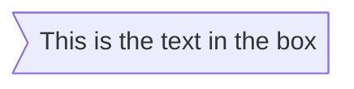

## A node (rhombus)

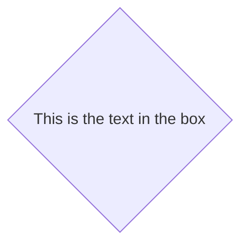

## A hexagon node


## Parallelogram

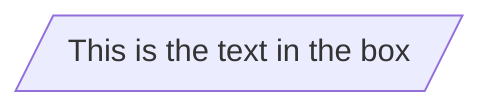

## Parallelogram alt

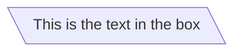

## Trapezoid

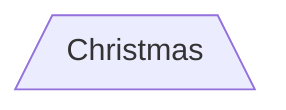

## Trapezoid alt

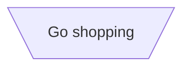

---


# Links between nodes

## A link with arrow head

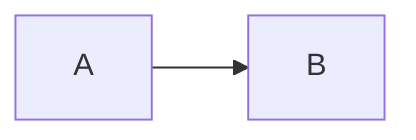

## An open link

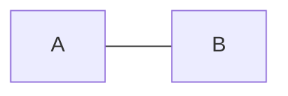

## Text on links

- 先頭が `-` 2つで、末尾が `-` ３つ
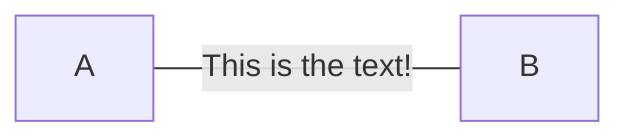

## A link with arrow head and text

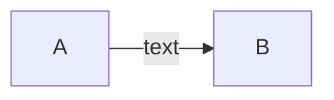
or
```mermaid
graph LR
  A-- text -->B
```

## Dotted link

```mermaid
graph LR;
  A-.->B
```

## Dotted link with text

```mermaid
graph LR
  A-. text .->B
```

## Thick link

```mermaid
graph LR
  A ==> B
```

## Thick link with text

```mermaid
graph LR
  A == text ===> B
```

## Chaining of links

```mermaid
graph LR
  A -- text --> B -- text2 --> C
```

```mermaid
graph LR
  a --> b & c --> d
```

```mermaid
graph TB
  A & B --> C & D
```
or
```mermaid
graph TB
  A --> C
  A --> D
  B --> C
  B --> D
```

## Beta: New arrow types

```mermaid
flowchart LR
  A --o B
  B --x C
```

## Beta: Multi directional arrows

```mermaid
flowchart LR
  A o--o B
  B <--> C
  C x--x D
```

## Minimum length of a link

- リンクに使う `-` の数を増やすと、通常のリンクよりも増やした分だけ多くのランクにまたがる表示になる
```mermaid
graph TD
  A[Start] --> B{Is it?};
  B -->|Yes| C[OK];
  C --> D[Rethink];
  D --> B;
  B ---->|No| E[End];
```
- リンクの中央にリンクラベルが書かれている場合は、リンクの右側にダッシュを追加する必要あり
```mermaid
graph TD
  A[Start] --> B{Is it?};
  B -- Yes --> C[OK];
  C --> D[Rethink];
  D --> B;
  B -- No ----> E[End];
```

## 点線または太いリンクの場合、追加する文字の要約

Length            | 1    | 2     | 3
------------------|------|-------|--------
Normal            | ---  | ----  | -----
Normal with arrow | -->  | --->  | ---->
Thick             | ===  | ====  | =====
Thick with arrow  | ==>  | ===>  | ====>
Dotted            | -.-  | -..-  | -...-
Dotted with arrow | -.-> | -..-> | -...->


---


# Special characters that break syntax


```mermaid
graph LR
  id1["This is the (text) in the box"]
```

## Entity codes to escape characters

```mermaid
graph LR
  A["A double quote:#quot;"] -->B["A dec char:#9829;"]
```


--


# Subgraphs

```
subgraph title
  graph definition
end
```

```mermaid
graph TB
  c1-->a2
  subgraph one
  a1-->a2
  end
  subgraph two
  b1-->b2
  end
  subgraph three
  c1-->c2
  end
```

- サブグラフに明示的なIDを設定することも可能
```mermaid
graph TB
  c1-->a2
  subgraph ide1 [one]
  a1-->a2
  end
```


---


# Beta: flowcharts

- グラフタイプのフローチャートを使用すると、以下のグラフのように、サブグラフとの間でエッジを設定することも可能

```mermaid
flowchart TB
  c1-->a2
  subgraph one
  a1-->a2
  end
  subgraph two
  b1-->b2
  end
  subgraph three
  c1-->c2
  end
  one --> two
  three --> two
  two --> c2
```


---


# Direction in subgraphs

```mermaid
flowchart LR
  subgraph TOP
    direction TB
    subgraph B1
      direction RL
      i1 -->f1
    end
    subgraph B2
      direction BT
      i2 -->f2
    end
  end
  A --> TOP --> B
  B1 --> B2
```


---


# Comments

- コメントアウトは先頭に `%%` を付与

```mermaid
graph LR
%% this is a comment A -- text --> B{node}
  A -- text --> B -- text2 --> C
```


---


# Styling and classes


## Styling a node

```mermaid
graph LR
  id1(start)-->id2(stop)
  style id1 fill:#f9f,stroke:#333,stroke-width:4px
  style id2 fill:#bbf,stroke:#f66,stroke-width:2px,color:#fff,stroke-dasharray: 5 5
```

## Classes

### スタイルのクラス定義
```
  classDef className fill:#f9f,stroke:#333,stroke-width:4px;
```

### ノードへのクラスのアタッチ
```
  class nodeId1 className;
```
- 1つのステートメントでノードのリストにクラスをアタッチすることも可能
```
class nodeId1,nodeId2 className;
```
- クラスを追加する短い形式は、 `:::` 演算子を使用してクラス名をノードにアタッチする
```mermaid
graph LR
  A:::someClass --> B
  classDef someClass fill:#f96;
```

## Default class

- クラスに `default` という名前が付けられている場合、特定のクラス定義なしですべてのクラスに割り当てられる
```
classDef default fill:#f9f,stroke:#333,stroke-width:4px;
```


---


# Basic support for fontawesome

```mermaid
graph TD
  B["fa:fa-twitter for peace"]
  B-->C[fa:fa-ban forbidden]
  B-->D(fa:fa-spinner);
  B-->E(A fa:fa-camera-retro perhaps?);
```


---


# Graph declarations with spaces between vertices and link and without semicolon

- グラフ宣言では、ステートメントもセミコロンなしで終了できるようになった
- グラフステートメントをセミコロンで終了することはオプション
- 頂点とリンクの間には単一のスペースが許可される
- ただし、頂点とそのテキスト、およびリンクとそのテキストの間にスペースがあってはならない

```mermaid
graph LR
  A[Hard edge] -->|Link text| B(Round edge)
  B --> C{Decision}
  C -->|One| D[Result one]
  C -->|Two| E[Result two]
```

