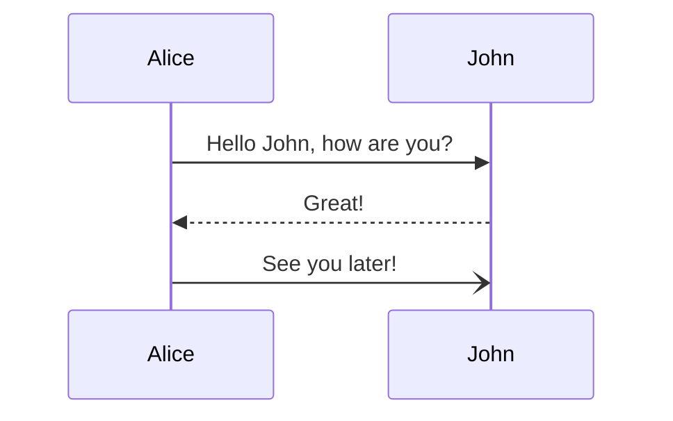
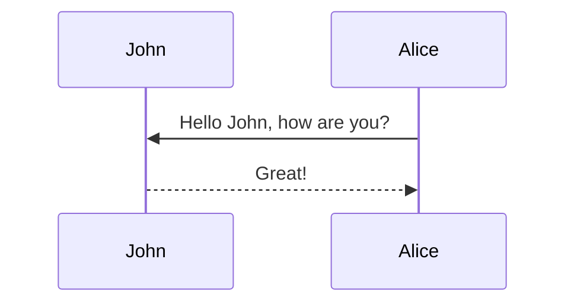
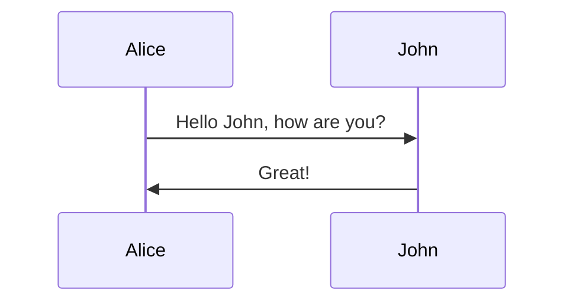

# Sequence diagrams

```mermaid
sequenceDiagram
  Alice->>John: Hello John, how are you?
  John-->>Alice: Great!
  Alice-)John: See you later!
```

---

## Syntax

### Participants (アクター)

```mermaid
sequenceDiagram
  participant John
  participant Alice
  Alice->>John: Hello John, how are you?
  John-->>Alice: Great!
```

### Aliases

```mermaid
sequenceDiagram
  participant A as Alice
  participant J as John
  A->>J: Hello John, how are you?
  J->>A: Great!
```

