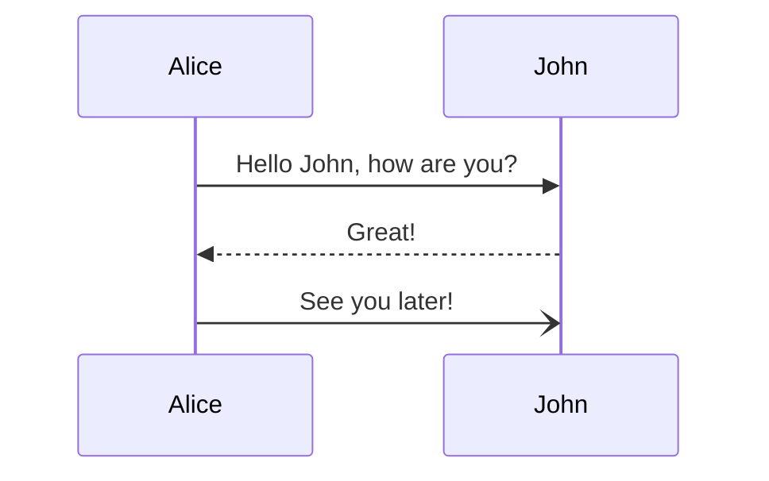
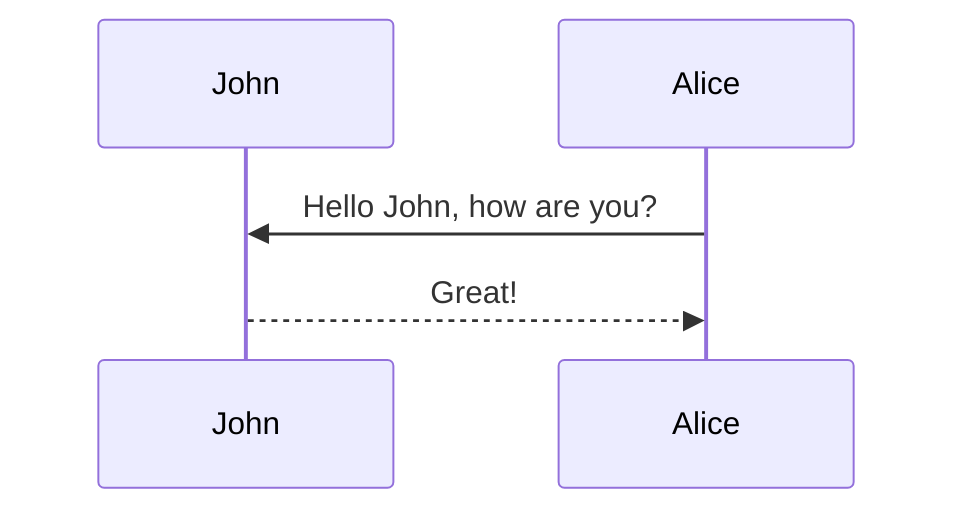
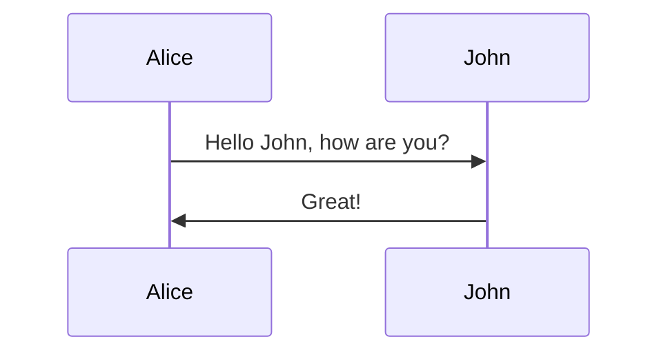
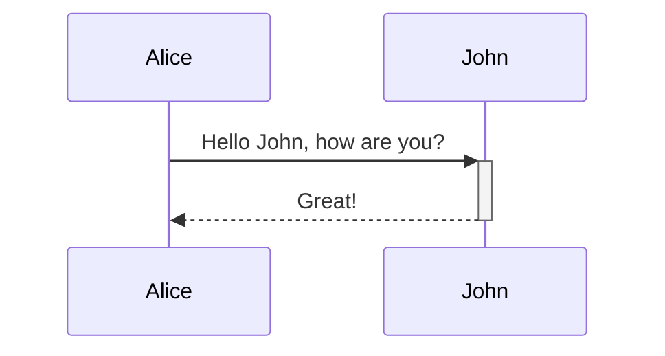
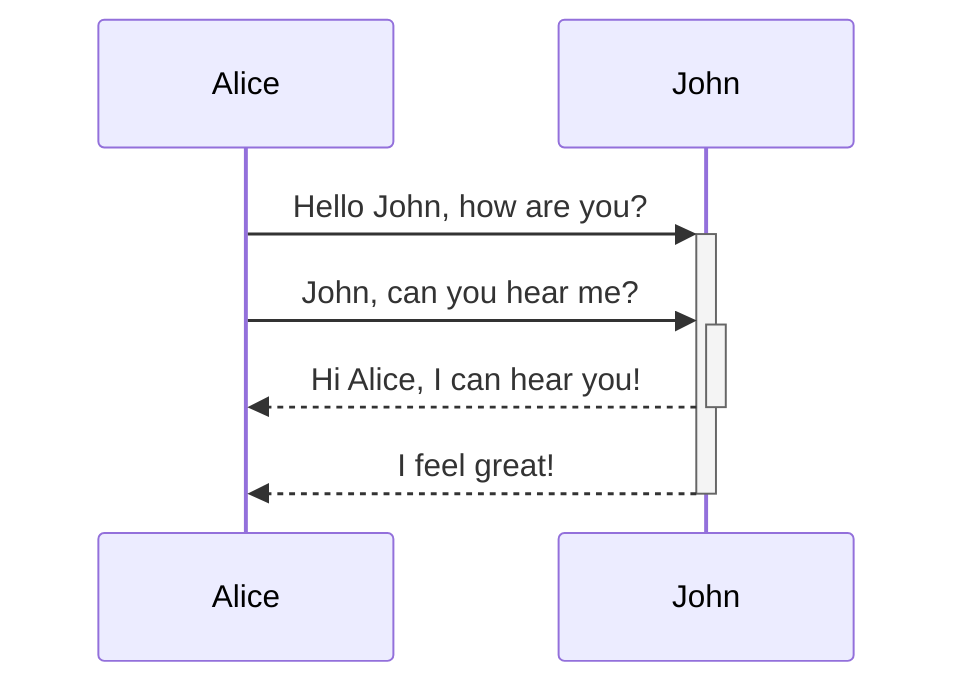
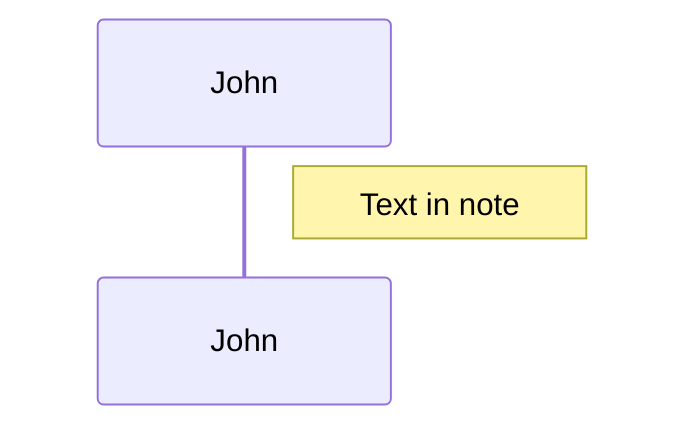
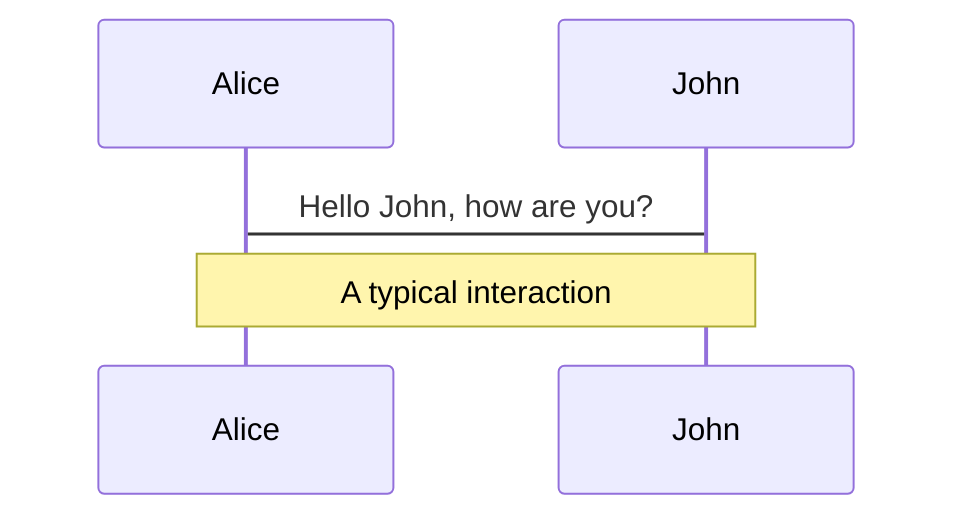
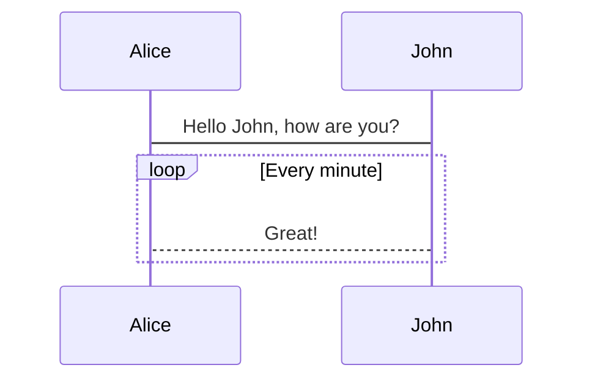
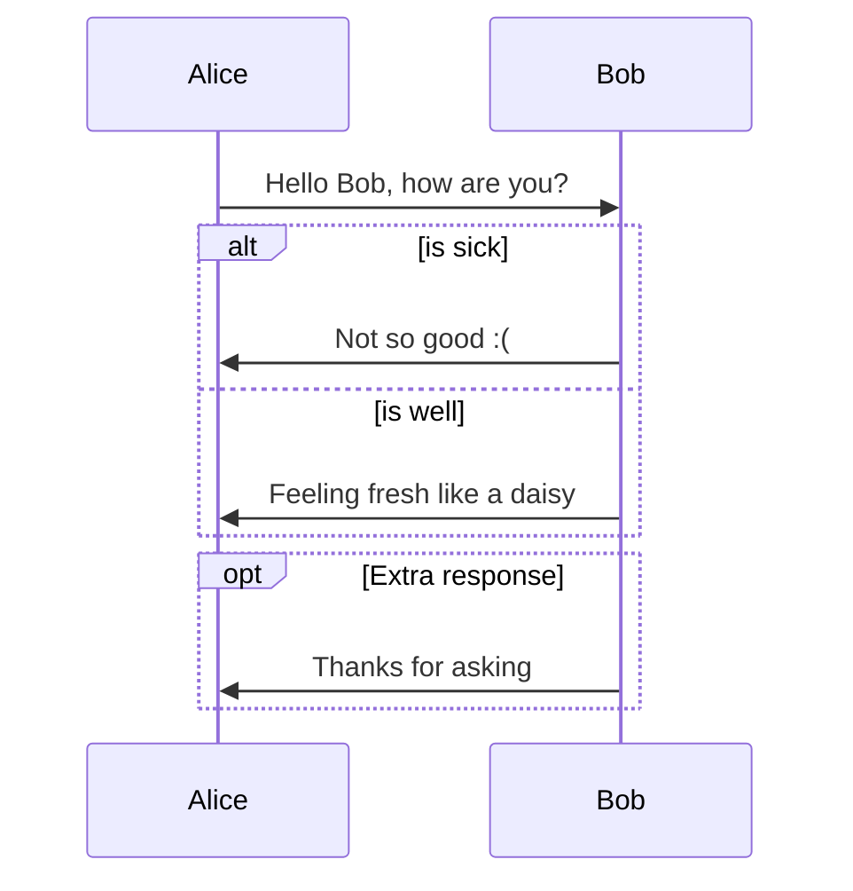

# Sequence diagrams





---


## Syntax


### Participants (アクター)



### Aliases




---


## Messages

- メッセージは、実線または点線で2つ表示できる

```
[Actor][Arrow][Actor]:Message text
```

### 現在サポートされている矢印の6種類

Type   | Description
------ | ------------------------------------------------
`->`   | Solid line without arrow
`-->`  | Dotted line without arrow
`->>`  | Solid line with arrowhead
`-->>` | Dotted line with arrowhead
`-x`   | Solid line with a cross at the end
`--x`  | Dotted line with a cross at the end.
`-)`   | Solid line with an open arrow at the end (async)
`--)`  | Dotted line with a open arrow at the end (async)


---


## Activations

- アクターをアクティブ化および非アクティブ化することができる
- （非）アクティブ化は、専用の宣言にすることができる

```mermaid
sequenceDiagram
  Alice->>John: Hello John, how are you?
  active John
  John-->>Alice: Great!
  deactivate John
```

- メッセージ矢印に`+`/`-`サフィックスを追加することによるショートカット表記も可能



- 同じアクターに対してアクティベーションをスタックできる




---


## Notes

- シーケンス図にメモを追加することができる
- `Note [ right of | left of | over ] [Actor]`



- 2人のアクターにまたがるメモを作成することもできる




---


## Loops

- シーケンス図でループを表現することができる

```
loop Loop text
... statements ...
end
```




---


## Alt

- シーケンス図で代替パスを表現することができる

```
alt Describing text
... statements ...
else
... statements ...
end
```

- オプションのシーケンスがある場合（elseが場合）
```
opt Describing text
... statements ...
end
```




---


## Parallel

- 並行して発生しているアクションを表示することができる
- 並列ブロックをネストすることも可能

```
par [Action 1]
... statements ...
and [Action 2]
... statements ...
and [Action N]
... statements ...
end
```


---


## Background Highlighting

- 色付きの背景長方形を提供することにより、フローを強調表示することができる
- 色は、 `rgb` および `rgba` 構文を使用して定義

```
rect rgb(0, 255, 0)
... content ...
end
```

```
rect rgba(0, 0, 255, .1)
... content ...
end
```

