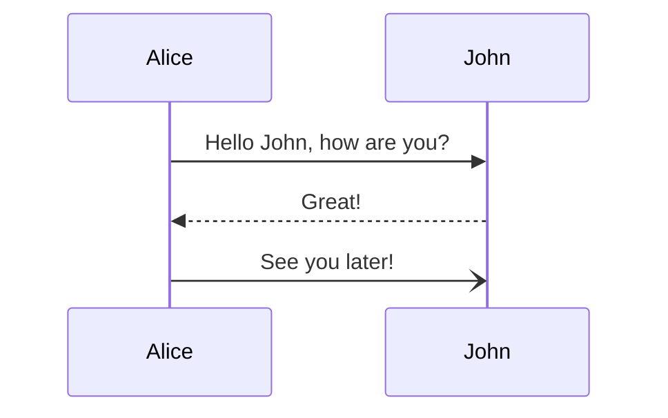
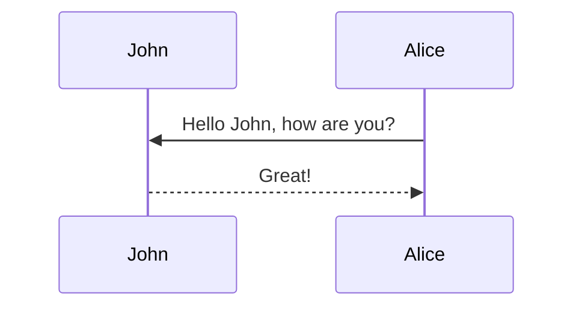
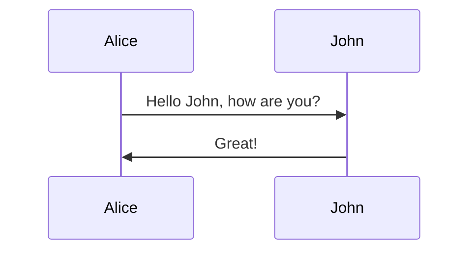

# Sequence diagrams





---


## Syntax


### Participants (アクター)



### Aliases




---


## Messages

- メッセージは、実線または点線で2つ表示できる

```
[Actor][Arrow][Actor]:Message text
```

### 現在サポートされている矢印の6種類

Type   | Description
------ | ------------------------------------------------
`->`   | Solid line without arrow
`-->`  | Dotted line without arrow
`->>`  | Solid line with arrowhead
`-->>` | Dotted line with arrowhead
`-x`   | Solid line with a cross at the end
`--x`  | Dotted line with a cross at the end.
`-)`   | Solid line with an open arrow at the end (async)
`--)`  | Dotted line with a open arrow at the end (async)


